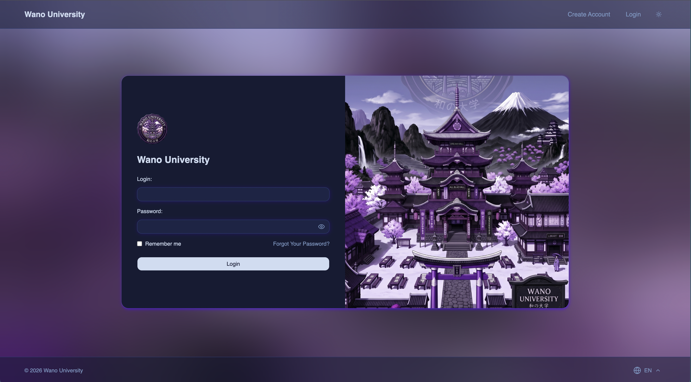
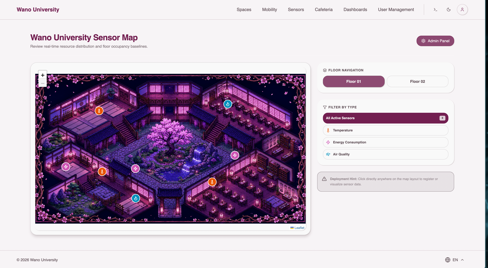
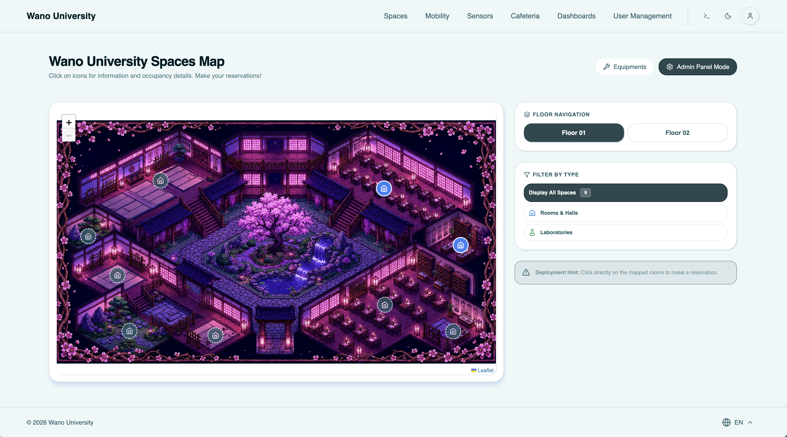
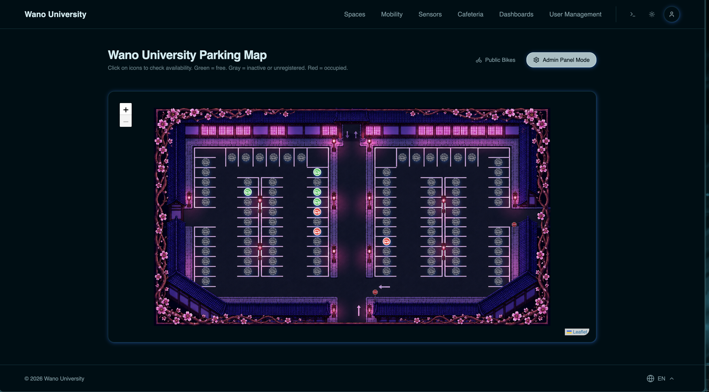
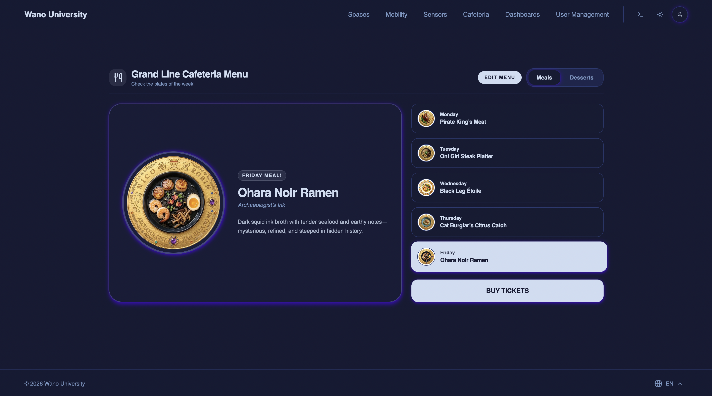
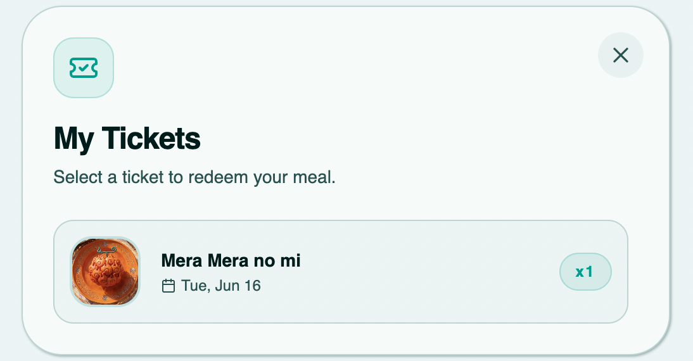
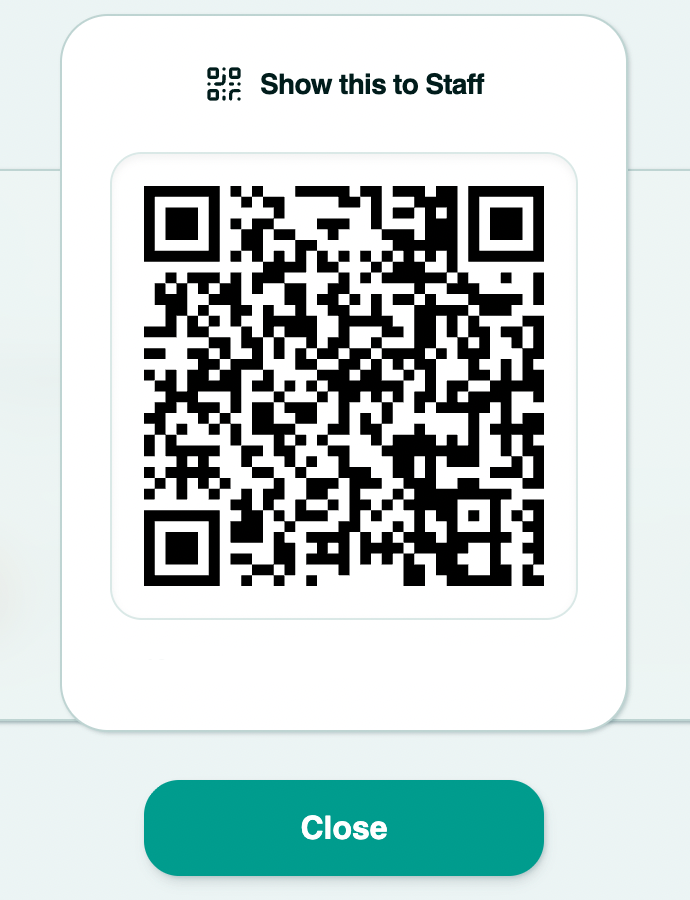
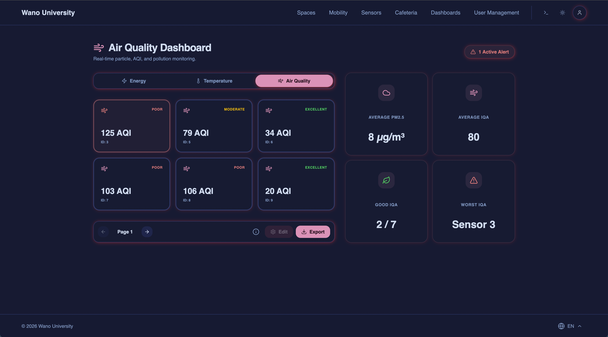
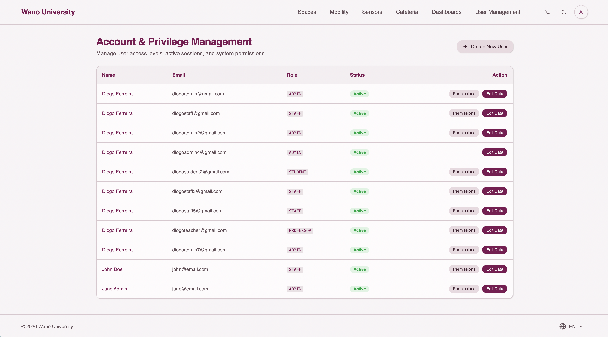
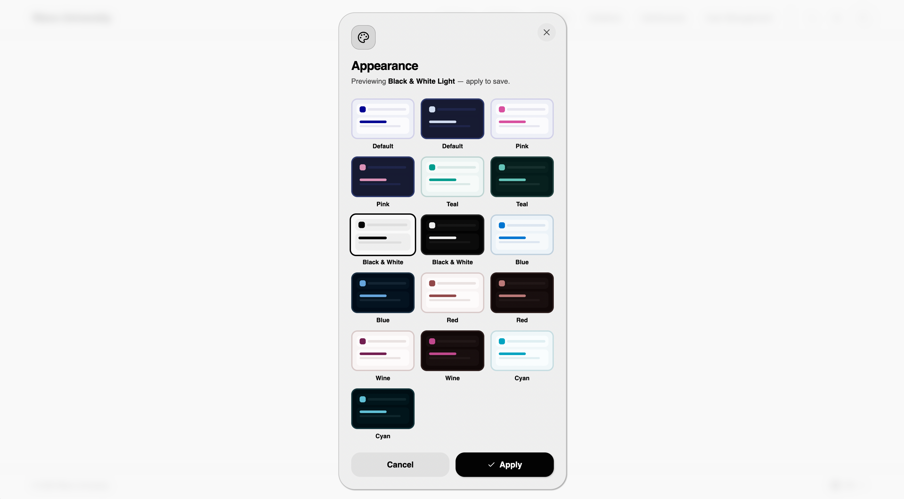

# Wano University Intelligent Campus Management Platform


Wano University is an integrated intelligent platform designed to monitor, manage, and optimize campus resources in real time. It handles spaces, equipment, mobility, sustainability indicators, and user management through a unified system architecture.

This platform was created as an interdisciplinary project for the Software Engineering, Web Technologies Laboratory, and Compilers modules.

## Architecture and System Design

The system follows a microservices oriented approach, separating the client, main API, and compiler services:
* **Frontend (React Vite):** Handles the user interface, state management, and real time data fetching. Communicates via REST with the Express backend.
* **Backend (Express.js):** Serves as the core API gateway. Handles business logic, Role Based Access Control authentication, and CRUD operations.
* **Database (PostgreSQL + Prisma):** Relational data persistence managed through Prisma ORM for type safe database access and schema migrations.
* **LSS Parser (FastAPI):** An isolated Python microservice built for the System Specific Language. It processes raw CLI inputs, parses the grammar, and triggers the corresponding functions in the main Express backend to execute batch operations or complex system queries.

## Features

* **Dynamic Interactive Maps (Leaflet):** Integrated Leaflet rendering for spatial awareness. Administrators can visually locate sensors, rooms, and parking spots, and can directly click on a map coordinate to register a new resource at that exact location.
* **Real Time Sensor Polling (SWR):** Utilizes SWR for immediate data validation and mutation, ensuring dashboards reflecting IoT sensor data update automatically without manual refresh.
* **Payment Gateway (Stripe):** Secure transaction handling for cafeteria ticket purchases.
* **QR Code Access Verification:** Generation and validation of QR codes. Staff can scan user codes to validate tickets, reservations and grant physical access.
* **Progressive Web App (PWA):** Service worker integration enables the platform to be installed natively on mobile devices.
* **Theming System:** Customizable UI themes for varying user preferences.
* **Security:** Enforces strict role-based routing (Admin, Staff, Professor, Student), encrypted password storage, and secure tokenized API communications.

## Hosting and Live Environment

* **Live Demo:** [wano-university.vercel.app](https://wano-university.vercel.app)
* **Frontend:** Hosted on Vercel.
* **Backend:** Hosted on Render. Note that the live version runs on the Render free tier. The server spins down after periods of inactivity, meaning initial requests may take 1 to 2 minutes to resolve as the instance wakes up.
* **Database:** Hosted on Neon.
* **LSS FastAPI Service:** Unhosted. Runs strictly in the local environment for testing the Compilers module.

## Screenshots

| Feature | Screenshot |
| :--- | :--- |
| **Login Page** |  |
| **Interactive Sensors Map** |  |
| **Interactive Spaces Map** |  |
| **Real-Time Parking Map** |  |
| **Cafeteria** |  |
| **Tickets** |  &nbsp;  |
| **IoT Dashboard** |  |
| **User Permissions** |  |
| **Customization** |  |

## Local Execution and Setup

To thoroughly test all platform features without server delay, the system must be executed locally.

### 1. Database Setup
Ensure you have a local PostgreSQL instance running. Run Prisma migrations to sync the schema:
```bash
cd backend
npx prisma generate
npx prisma db push
```

### 2. Backend (Express)
Navigate to the backend directory, install dependencies, and start the server:
```bash
cd backend
npm install
node --watch src/index.js
```

### 3. Frontend (React Vite)
Navigate to the frontend directory. To enable the QR code verification feature via a mobile device on your local network, you must bind the server to your local IP using the host flag:
```bash
cd frontend
npm install
npm run dev -- --host
```
Access the provided Network IP on your mobile device while logged in as a Staff to test the QR scanner functionality.

### 4. LSS Parser (FastAPI)
Navigate to the compiler directory. Since the environment uses Pipenv but also includes a `requirements.txt`, you can install dependencies and run the application via Uvicorn targeting the `api.py` file:
```bash
cd compilers
pipenv install
pipenv run uvicorn api:app --reload
```

## Team Members

- [Diogo Ferreira](https://github.com/diogof146)
- [Manuela Mora](https://github.com/ManuYepes)
- [Tomás Falcão](https://github.com/Falconz0012)
- [Diogo Oliveira](https://github.com/DiogOlivas)
- [Guilherme Santos](https://github.com/MrGu111)

## Acknowledgements

Special thanks to Bruno Cunha and Maria João for their guidance and support throughout the development of this project.
